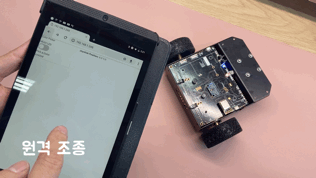
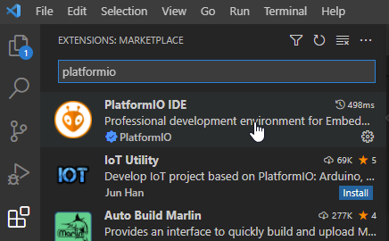
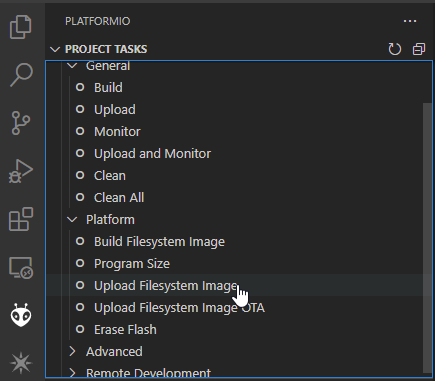
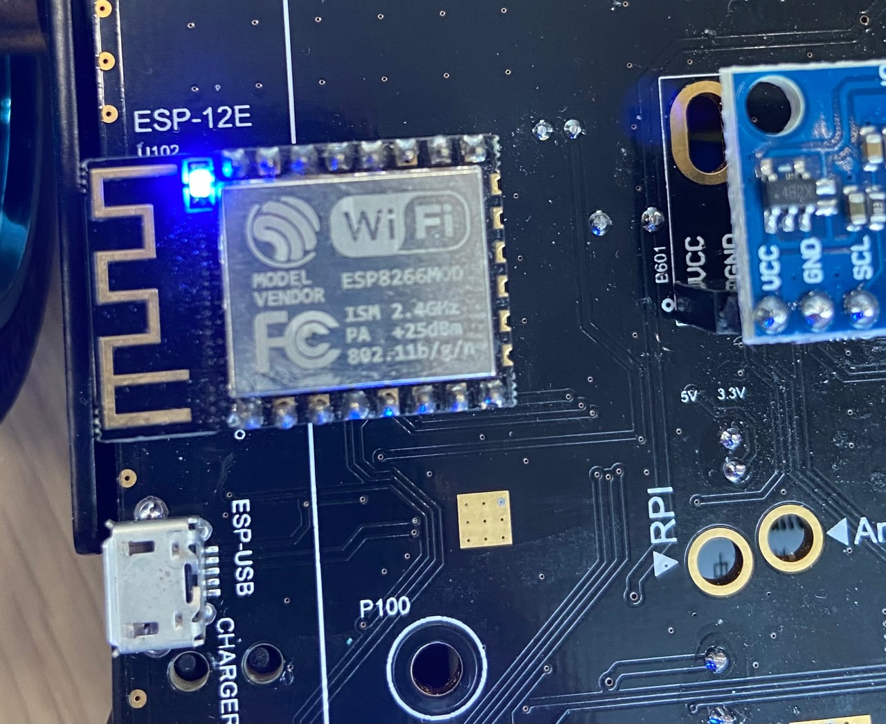
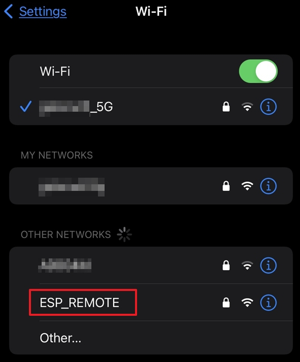

# ESP8266 based web controller for R1mini

한국어 문서는 [다음](README_KR.md) 를 참조하십시오.  
For Korean, refer to [README_KR](README_KR.md) document.  

## 1. Introduction
[R1mini](https://www.omorobot.com/omo-r1mini "R1mini") is a smaller sized mobile robot platform from omorobot.com and is equipped with ESP8266 module so that you can upload your own arduino sketch and control the robot directly from the board.

This repository demonstrates how to connect the onboard ESP8266 board to a 2.4GHz wifi router and open a web server for user to send control message to the robot.

With this project, user can do followings with R1mini.  

- Remotely controlling the robot.  
<div align="center">
 
</div>

- Change colors onboard RGB leds or turn on/off headlights.  

<div align="center">
 
 
</div>


Below video shows how it works when you upload this sketch to the board.
[](https://www.youtube.com/watch?v=ax5wqK-Vj8c)


### 1.1 Requirements

- R1mini platform: You can order from [omorobot](https://www.omorobot.com "OMOROBOT INC")
- ESP-12E module
<div align="center">
 
</div>  

- Your PC
- A micro usb cable.
- Any wifi router that supports 2.4GHz signal.

## 2. Setting up for development environment

This repository is aimed to build using PlatformIO extension for Visual Studio Code (VS Code) which is very conveinent for mananging libraries for any arduino based project. 

### 2.1 Download or clone the project

Download a zip file of this repsitory or git clone this project by enetering  
```
git clone https://github.com/kyuhyong/r1mini_esp_remote.git
```
### 2.2 Install PlatformIO extension for VS Code

1. Go to VS Code download page [here](https://code.visualstudio.com/download) and download for your PC environment
2. Run VS Code and select Extensions to search PlatformIO and then install it.
<div align="center">
 
</div>

### 2.3 Open up the project

1. Run VS Code and select File -> Open Folder... from top menu to open this project.

2. Upon loading this project, **PlatformIO** will automatically download any required libraries.

## 3. Uploading the sketch

Connect a micro usb cable to the left side of R1mini and your PC as below.
<div align="center">
 
</div>

### 3.1 Upload filesystem

To run this proejct, it is required to upload joystick.html, app.js and styles.css files under /data to the flash memmory in ESP module.

Press **Alien** icon in the left panel and click "**Upload Filesystem Image**" under PROJECT TASK/Platform
<div align="center">
 
</div>

### 3.2 Upload sketch to ESP

To build and upload the program, select **Arrow icon** in the bottom left.

<div align="center">
 
</div>

Once build is done, it will automatically start upload the code to ESP module.

<div align="center">
 
</div>

## How to connect to a new WiFi router

### Change to AP mode
1. Power on the robot.  

2. <a name="B2"></a>Press **D1** button and hold until **onboard** Blue LED turn on.]
  <div align="center">
    
  </div>

3. If onboard Blue LED turned on, release **D1** button.  

4. The board will start AP mode with SSID "**ESP_REMOTE**" and password as "**password**"  

5. Try to find wifi AP with above info and connect.  
  <div align="center">
    
  </div>

6. A webpage will open automatically or enter 192.168.4.1 to enter configuration page.  
  <div align="center">
    
  </div>

7. Select Configuration and find SSID of the router you want to connect.
    Note, only wifi with 2.4GHz works with ESP board.  
  <div align="center">
    
  </div>
    Enter the password configured in the router and press SAVE button.  

8. Wait for a while and the blue LED will be turned off. If eveything setup correctly, you can check IP address assigned to the ESP board by repeating [2.](#B2) and connect to ESP8266_R1mini again and remember this IP address.  
  <div align="center">
    
  </div>

9. Press Exit and disconnect from ESP board.  

10. Connect your smartphone or tablet to the router.  

11. Open up a browser and enter the IP address you just checked from ESP board.  

12. Enjoy the robot.  
