# ESP8266 웹 기반 조이스틱 제어

## 1. 소개

본 프로젝트는 ESP32 보드를 통해 WiFi 라우터에 접속하여 웹 서버를 열고 브라우저를 통해 접근한 사용자의 조이스틱 입력을 로봇에 전달하는 데모 프로그램입니다.  

이 프로그램을 통해 사용자는  

- 로봇을 원격으로 제어하거나,  
<div align="center">
 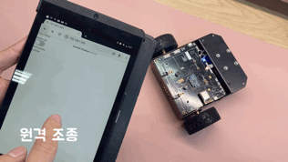
</div>

- 로봇의 RGB LED 의 색상을 변경하거나 헤드라이트 LED를 켜고 끌 수 있습니다.  

<div align="center">
 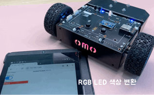
 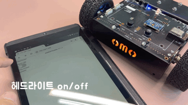
</div>

### 1.1 준비물

- 로봇 플랫폼: 예제로 사용된 **R1mini Basic** 버전은 메카솔루션 [홈페이지](https://mechasolution.com/shop/goods/goods_view.php?goodsno=592843&category=140023) 그리고 **R1mini-PRO** 버전은 오모로봇 [네이버쇼핑몰](https://smartstore.naver.com/omorobot/products/6101472906)를 통해 구매하실 수 있습니다.
- ESP-12E 모듈: 이 프로젝트 스케치를 실행하기 위한 소형 컨트롤러 모듈입니다. 오모로봇 [네이버쇼핑몰](https://smartstore.naver.com/omorobot/products/5929775595)에서 구매할 수 있습니다.
<div align="center">
 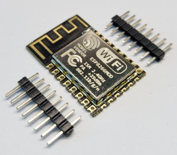
</div>  

- 마이크로 USB 케이블
- 사용자 PC
- 2.4기가 주파수를 지원하는 wifi 라우터

## 2. 개발환경 꾸미기

이 프로젝트는 개발의 편의를 위해 **VisualStudio Code**(이하 vs 코드)의 Extension인 PlatformIO 프로젝트로 만들어졌습니다.  
Arduino IDE를 사용하여 스케치를 업로드하는것도 가능하지만 프로젝트 관리가 쉽고, 웹 인터페이스를 위한 코드 수정이 용이한 **vs 코드**를 통해 빌드/업로드 하는것을 권장합니다.

### 2.1 프로젝트 다운로드

이 프로젝트의 zip 파일을 다운로드하거나 git clone 명령으로 이 프로젝트를 다운로드합니다.
```
git clone https://github.com/kyuhyong/esp_web_joystick.git
```

### 2.2 VS 코드 및 PlatformIO 설치하기

1. vs 코드 다운로드 [페이지](https://code.visualstudio.com/download)로 이동하여 본인의 PC환경에 맞는 vs 코드를 다운로드하고 설치합니다.  
2. vs 코드를 실행한 다음 좌측 Extensions를 눌러 platformio를 검색하고 install 합니다.  
<div align="center">
 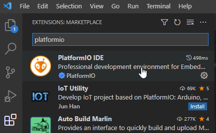
</div>

### 2.3 프로젝트 열기

1. **vs 코드**를 실행하고 상단 메뉴에서 File -> Open Folder... 를 선택하여 앞에서 다운로드한 프로젝트 위치를 엽니다.

2. **PlatformIO**가 자동으로 프로젝트를 인식하고 필요한 라이브러리를 다운로드합니다.

## 3. 프로그램 업로드 하기

마이크로 USB 케이블을 아래 그림과 같이 R1mini의 좌측 포트에 연결합니다.
<div align="center">
 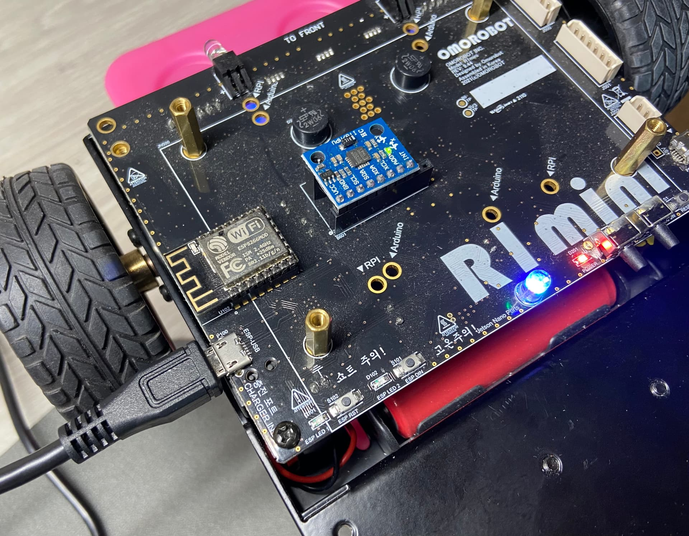
</div>


### 3.1 플래시에 파일시스템 업로드하기

이 프로젝트를 실행하기 위해서는 /data 안에 있는 joystick.html, app.js 그리고 styles.css와 같은 스크립트 파일이 ESP 보드의 플래시 영역에 업로드 되어야 합니다.  

프로젝트 메뉴 좌측의 **외계인 아이콘**을 누르고 아래 그림과 같이 PROJECT TASK 항목에서 Platform 아래 "**Upload Filesystem Image**" 를 클릭합니다.
<div align="center">
 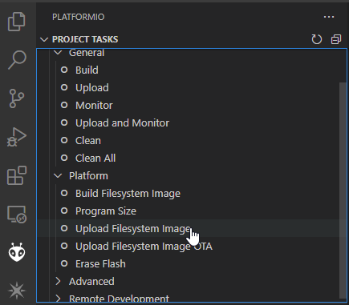
</div>

### 3.2 스케치 업로드 하기

이제 프로젝트를 빌드하고 업로드하기 위해 좌측 하단의 **화살표 모양** 아이콘을 눌러 업로드를 시작합니다.
<div align="center">
 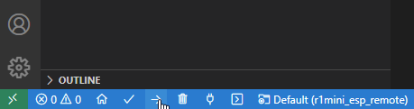
</div>

빌드가 완료되면 아래 그림과 같이 업로드를 시도합니다.

<div align="center">
 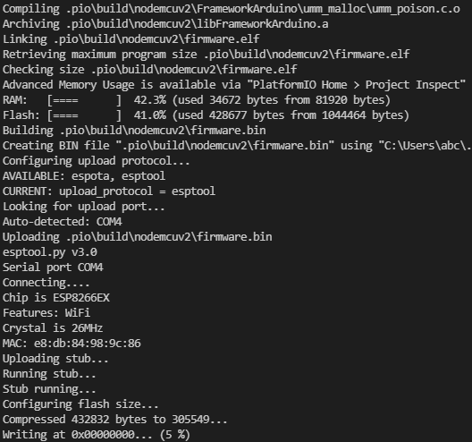
</div>

## 4. ESP 모듈의 WiFi 설정하기

모든 과정이 끝나면 이제 ESP 모듈을 설정하여 wifi 라우터에 접속하도록 합니다.  
만약 이 과정을 처음 수행하는 경우 디버깅을 위해 usb 케이블을 연결하고 아래 그림과 같이 시리얼 모니터를 열고 설정하는것이 좋습니다.  
    <div align="center">
      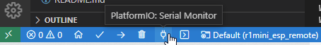
    </div>


### 4.1 AP 모드로 변경하기

만약 내부에 아무런 설정이 없는 경우 자동으로 AP 모드로 접속하게 됩니다.  
ESP32 모듈에 할당된 IP를 모르는 경우 다음을 수행하여 AP 모드로 변경하여 내부 IP 주소를 확인할 수 있습니다.  

1. 로봇을 켭니다.  

2. <a name="B2"></a>**D1** 버튼을 약 3초간 누른 후 ESP32 **내장LED** 가 켜질때까지 기다립니다.  
    <div align="center">
      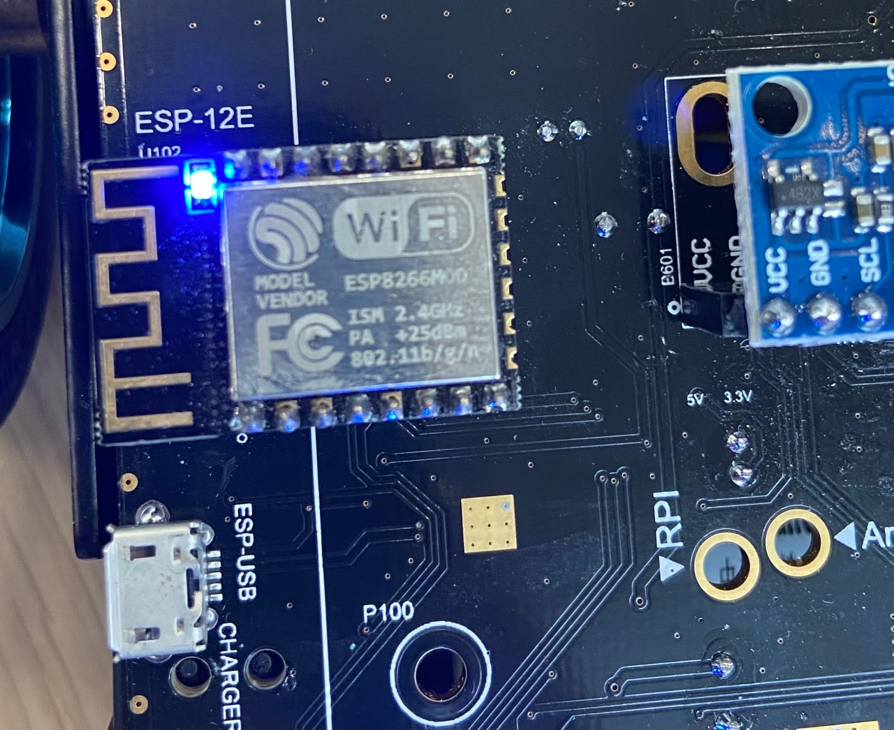
    </div>

3. 내장된 파란 LED가 켜지면 **D1** 버튼을 뗍니다.  


4. 이제 보드는 SSID 가 "**ESP_REMOTE**" 이고 패스워드가 "**password**" 인 AP로 전환됩니다.  

5. 스마트폰 혹은 태블릿의 WiFi 설정을 열어서  설정된 AP를 찾아서 접속합니다.  
    <div align="center">
      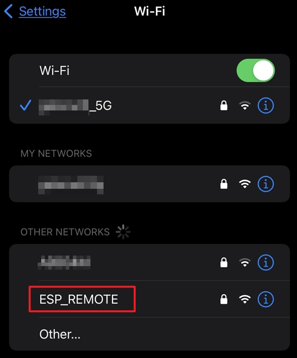
    </div>  


6. 성공적으로 접속하게되면 설정 페이지가 자동으로 뜹니다. 또는 브라우저에서 192.168.4.1 로 접속을 시도합니다.  
    <div align="center">
      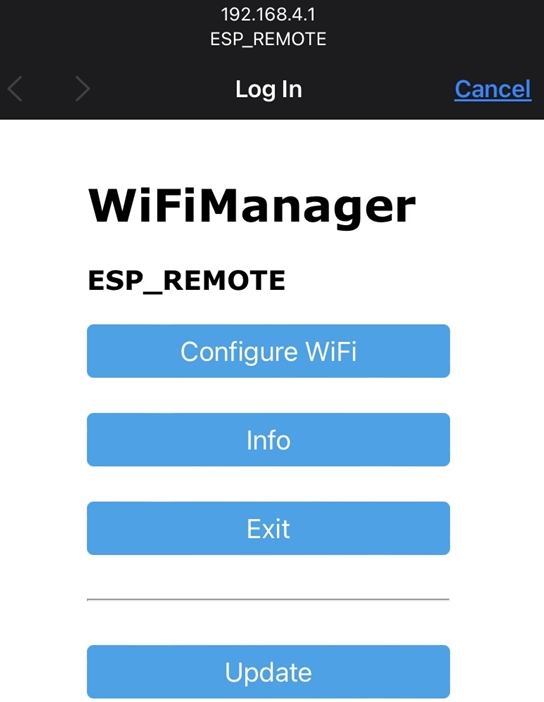
    </div>


7. Configure WiFi 버튼을 누르고 접속하고자 하는 라우터의 SSID 를 선택하고 비밀번호를 **SAVE** 버튼을 누릅니다.  
  주의, 2.4기가 WiFi만 접속 가능합니다.  
  <div align="center">
    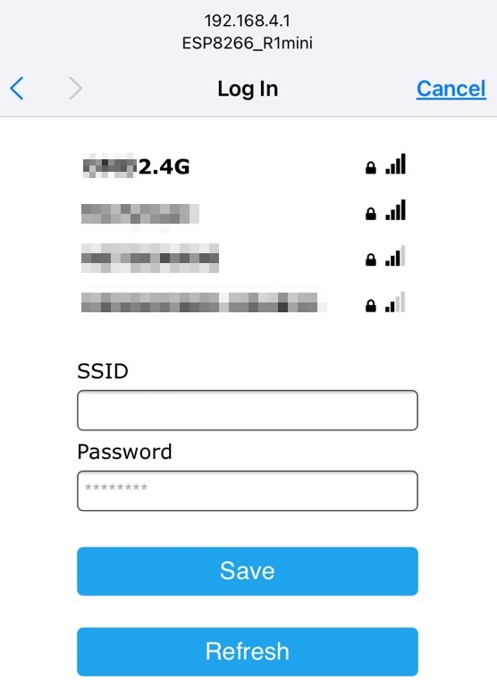
  </div>  


8. 잠시 기다리면 파란색 LED가 꺼지고 동작을 시작합니다. 이제 보드에 할당된 IP주소를 확인하기 위해 [2번](#B2) 항목을 다시 수행하여 ESP8266_R1mini에 접속하여 라우터에서 할당받은 IP주소를 확인합니다.  
  주의, IP 주소는 라우터에 접속할때마다 변경될 수 있습니다.  
  <div align="center">
    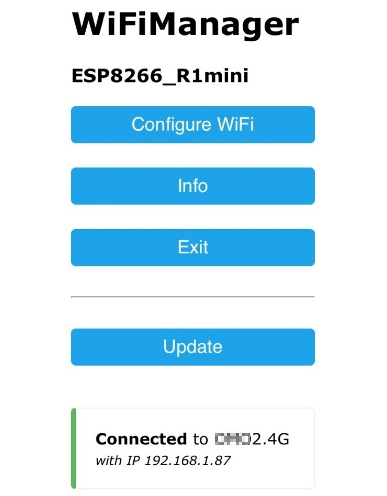
  </div>


9. Exit 버튼을 눌러 접속을 해재합니다.  

10. 이제 휴대폰의 WiFi설정을 열어서 라우터에 접속합니다.  

11. 브라우저를 열고 ESP32모듈에 할당된 IP주소를 입력하여 로봇에 접속합니다.  

12. 로봇을 가지고 놉니다.


